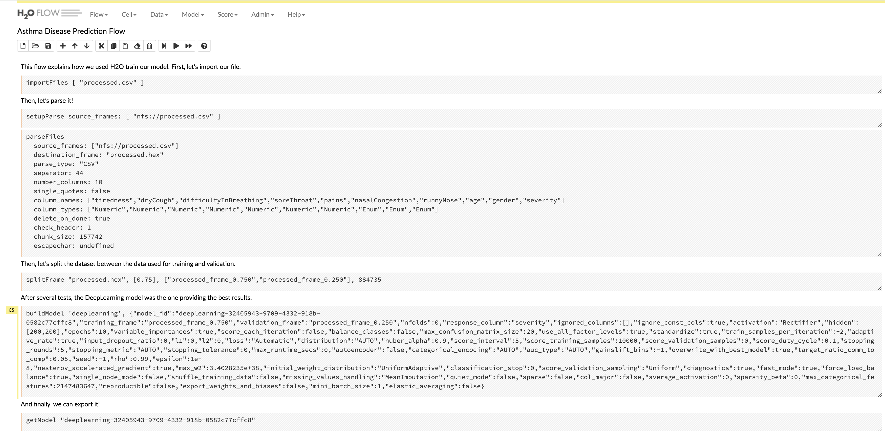
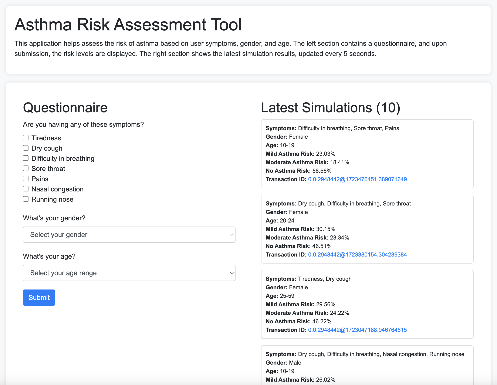

# Hello Future Hackathon 2024 Submission

## Project Name: *HealthGuard AI*

### Table of Contents
1. [Project Overview](#project-overview)
2. [Features](#features)
3. [Tech Stack](#tech-stack)
4. [Development Steps](#development-steps)
5. [Usage](#usage)
6. [Demo](#demo)
7. [Architecture](#architecture)
8. [Challenges Faced](#challenges-faced)
9. [Future Improvements](#future-improvements)
10. [Why This Project Should Win?](#why-this-project-should-win)
11. [Contributors](#contributors)
12. [License](#license)

---

## Project Overview

HealthGuard AI is an innovative platform designed to enhance the transparency and auditability of AI-driven health predictions, starting with asthma and expanding to cancer and other critical health areas. By leveraging Hedera's decentralized ledger technology, HealthGuard AI ensures that every data point, model trace, and prediction is immutably recorded, fostering trust in AI outcomes.

Our platform integrates with H2O for AI model development, offering a comprehensive API for seamless access and full traceability.

HealthGuard AI aims to revolutionize how AI models are perceived and utilized in healthcare, ensuring that the models are not black boxes but transparent, auditable, and trustworthy. This solution has broad implications for improving patient outcomes, especially in partnership with organizations like the Cancer Foundation.

HealthGuard AI contributes to the growth of the Hedera network by introducing a novel application in the healthcare industry, driving adoption through our various partnership including the Cancer Foundation and ensuring that AI in healthcare meets the highest standards of transparency and accountability.

## Features

- Immutable traceability of datasets and AI models.
- Full auditability of predictions.
- Expansion into cancer research and other health domains.
- Comprehensive API for easy integration.
- User-friendly frontend for dataset browsing and AI interaction.

## Tech Stack

- **Frontend:**: HTML, CSS, Vue.js
- **Backend:** Lambda functions implemented in Python and Node.js
- **Database:** MongoDB Serverless
- **Other Technologies:** ACOER Data Stamping solutions for every interaction with the Hedera metwork

## Development steps

### Dataset Preparation

We started with an open-source dataset from [Kaggle](https://www.kaggle.com/datasets/deepayanthakur/asthma-disease-prediction) focused on asthma disease prediction. To make the data ready for AI ingestion, we undertook several preprocessing steps:
- Renamed and standardized column names.
- Reorganized response columns to streamline API integration.
- Consolidated age data into a single column using enumerations.
- Unified severity data into one column using enumerations.

Both the original and processed datasets are available in the `datasets` subfolder.

### AI Training

As mentioned in the introduction, we utilized the [H2O Open Source platform](https://docs.h2o.ai/h2o/latest-stable/h2o-docs/downloading.html) to develop our AI model. H2O is a powerful machine learning and artificial intelligence framework that supports a wide range of algorithms and is known for its scalability and ease of use. Since this is a Hedera-focused hackathon, we won't delve too deeply into H2O itself, but we primarily interacted with it through the "Flow" component, a user-friendly interface for building machine learning models. Using H2O, we conducted multiple simulations to refine our AI model. Upon completion, we downloaded a package from H2O that contains the full specifications of our AI model.

The flow file can be found in the `flow` subfolder and can be reimported as you wish.

The following steps were executed within the Flow file:
- Imported the CSV file and parsed the data.
- Split the data into two frames: one for training and one for validation.
- Generated a Deep Learning model using a customized configuration.
- Exported the generated model for further use.



Deep learning is a subset of machine learning that involves training artificial neural networks with multiple layers to recognize patterns and make decisions. These networks are designed to mimic the way the human brain processes information, enabling them to learn complex features from large amounts of data. Deep learning models are particularly effective for tasks such as image and speech recognition, natural language processing, and predictive analytics. By using multiple layers, or "deep" architectures, these models can capture intricate patterns and relationships within the data, leading to highly accurate predictions.

The generated deep learning model can be found in the subfolder `model`.

### Auditability of the Prediction Model Development

To ensure transparency, we recorded a unique stamp containing the following information related to this GitHub project:
- MD5 hash of the original dataset `f816141027bf6b4f62a6e3dbabff2a32`
- MD5 hash of the processed dataset `643449a62e9ccad1a0fa6b302ffb7f42`
- MD5 hash of the H2O Flow file `71aa3570e595653e4bbd6c0cc8a5362f`
- MD5 hash of the deep learning model `a311ae90a795c2c463e0177945adc98d`

By using the files provided in this project, anyone can replicate our steps and verify that everything was conducted correctly. Transparency and auditability in AI models are crucial for building trust, ensuring accountability, and validating the integrity of the predictions made by these models. In critical fields like healthcare, where decisions impact lives, it's essential that AI models are not black boxes. Instead, they should be transparent and open to scrutiny, allowing stakeholders to trace the model's decision-making process and ensure that it adheres to ethical and accurate standards.

The following command has been executed to record a trace in Hedera Testnet. This is using Data Stamping APIs provided by Hashlog. This product will be documented below.

```bash
curl -X POST "https://external.hashlog.io/event" \
  -H "APIKey: hbar_tk_BOI7ivXjaf3lIy35QtpVIFp3VpWJqTo57RXPvQHEb8NXIAex" \
  -H "Content-Type: application/json" \
  --data '{"data":"{\"dataset\":{\"original\":\"f816141027bf6b4f62a6e3dbabff2a32\",\"processed\":\"643449a62e9ccad1a0fa6b302ffb7f42\"},\"flow\":\"71aa3570e595653e4bbd6c0cc8a5362f\",\"model\":\"a311ae90a795c2c463e0177945adc98d\"}"}'
```

The transaction is `0.0.2948442@1723464162.494331476` and you can see the trace in HashScan: https://hashscan.io/testnet/transaction/1723464172.180837072

### Exposing the Prediction Model

The next step was to expose our prediction model via an API. Since Python is the primary language used, and H2O provides a Python SDK, we chose to create a Docker image that packages this API. For simplicity, we used Flask, a lightweight web framework for Python, known for its ease of use and flexibility in creating APIs.

The code for this setup can be found in the `predict-endpoint` subfolder, which includes:
- `Dockerfile`: Instructions to package the code as a Docker image.
- `app.py`: The file responsible for exposing the `/predict` endpoint, utilizing the Deep Learning models stored in the `models` subfolder.

To build the Docker image, use:

```bash
docker build -t ac-py-predict .
```

You can then run it locally with:

```bash
docker run -p 5000:5000 ac-py-predict
```

To test the prediction model locally, execute:

```bash
curl 'http://localhost:5000/predict' \
  -H 'content-type: application/json' \
  --data '{"tiredness":0,"dryCough":0,"difficultyInBreathing":0,"soreThroat":0,"pains":0,"nasalCongestion":0,"runnyNose":1,"age":"20-24","gender":"Female"}'
```

This should return a prediction similar to:

```bash
[
    [
        "predict",
        "Mild",
        "Moderate",
        "None"
    ],
    [
        "None",
        "0.25553727144197236",
        "0.25137135906294755",
        "0.4930913694950801"
    ]
]
```

This result indicates a 25% risk of mild asthma, 25% risk of moderate asthma, and a 50% chance of no asthma.

We published this docker image in a public repository that we host in AWS ECR: `public.ecr.aws/y3q1s2x2/ac-py-predict`. So anyone can just pull the latest image: `public.ecr.aws/y3q1s2x2/ac-py-predict:latest`.

Ideally this prediction endpoint won't be public and will be accessible only from the endpoint documented in the following section. For this hackhaton, we deployed it in our AWS instance using ECS. The endpoint is: `http://34.207.200.229:5000/predict` (Note: This endpoint may not be available in the future).

### Exposing the Public Endpoints

The next step is to expose public endpoints that will allow the frontend to perform two key functions: executing predictions (with full auditability for each prediction) and tracking all predictions made.

Auditability of predictions is crucial, especially in the context of ethical AI. By ensuring that every prediction can be traced and verified, we maintain transparency and accountability, which are essential for building trust in AI systems. This transparency is particularly important in healthcare, where AI decisions can have significant impacts on patient outcomes. Ensuring that predictions are auditable prevents the model from becoming a "black box" and helps to identify biases or errors, promoting responsible and fair use of AI technologies. In a world where AI is increasingly integrated into critical decision-making processes, the ability to audit and understand these decisions is fundamental to maintaining ethical standards and ensuring that AI serves all individuals equitably.

We opted to use serverless functions, specifically AWS Lambda functions, deployed via the Serverless Framework. These functions are located in the `public-endpoints` subfolder and expose three endpoints:

- A POST endpoint `/predict` that receives requests from the frontend, calls the Python prediction endpoint, and records the results in MongoDB Serverless.
- A POST endpoint `/webhook` that handles notifications from Hashlog DataStamping APIs once a transaction is fully submitted.
- A GET endpoint `/predictions` that returns the latest 10 predictions, primarily for demo purposes.

To deploy this in your AWS account, update the following environment variables in the configuration:

```yaml
  environment:
    MONGODB_URI: 'XXX'
    HASHLOG_API_KEY: 'YYY'
    PREDICT_ENDPOINT: 'http://34.207.200.229:5000/predict'
```

Then, run the deployment with:

```
serverless deploy
```

After deployment, you’ll receive the URLs of the endpoints to use. We have deployed our version on AWS, accessible at https://wo41zg8yv4.execute-api.us-east-1.amazonaws.com (Note: This endpoint may not be available in the future).

### Frontend Implementation

We focused primarily on the backend, so the frontend implementation was kept simple. The interface was developed to support two main use cases:
- Executing predictions
- Tracking predictions and ensuring they are properly audited on Hedera

We chose Vue.js for a quick and efficient implementation. To run it locally, you can use the `http-server` package from npm. However, we have also deployed a version on AWS S3, which is accessible here: [Frontend on AWS S3](https://hedera-hackhaton-2024.s3.amazonaws.com/index.html).

### Integration with Hedera Consensus Service (HCS)

Our product is already fully integrated with the Hedera Consensus Service (HCS) leveraging our product ACOER's Data Stamping API, which utilizes HCS to ensure that every transaction, data entry, and AI prediction is transparently recorded and immutably stored on the Hedera network.

#### Technical Details

- Digital Signatures: Each data point is signed with a digital signature, providing a unique fingerprint that verifies the authenticity of the data.
- Hash Functions: The API uses hash functions to create a fixed-size representation of the data, enhancing security by ensuring that any tampering with the data would be easily detectable.
- Trusted Timestamping: The API integrates with HCS to provide accurate, immutable timestamps for every data entry, ensuring that the timing of transactions is always verifiable.

By leveraging these technologies, our implementation guarantees that all data interactions are secure, transparent, and auditable. The seamless integration with HCS enables our platform to maintain a high level of trust and accountability, which is especially critical in healthcare and other sensitive fields. This robust infrastructure not only supports our current use cases but also lays the foundation for future expansions into more complex and impactful applications, such as cancer prediction models and mortality data analysis.

## Usage

To experience our demo product, visit this page. The process begins with filling out the questionnaire on the left side of the interface. It’s important to complete all the fields to ensure the prediction is as accurate as possible. Once you submit the information, the system will calculate and display your risk levels for Mild asthma, Moderate asthma, or no asthma.

As soon as the prediction is generated, a new entry will appear on the right side of the interface, detailing your simulation. Initially, the Hedera transaction ID will be missing until the transaction is fully processed. Once completed, the transaction ID will appear, allowing you to click on it to open Hashscan. This ID represents a Topic Message within the Hedera Consensus Service (HCS). By viewing the message associated with the transaction, you can verify the input data and the prediction provided, ensuring transparency and auditability in the process.



## Demo

TODO

## Architecture

TODO

## Challenges Faced

- Finding Relevant and Usable Open-source Data: One of the initial challenges was identifying a dataset that was both relevant to the hackathon's theme and suitable for AI modeling. Ensuring the dataset was high-quality, had enough data points, and was formatted appropriately for ingestion into machine learning models required extensive searching and evaluation.
- Learning H2O and Building a Model from Scratch: As newcomers to the H2O platform, we had to quickly learn how to use its various components, especially "Flow," to create a robust AI model. This involved understanding H2O's documentation, experimenting with different configurations, and running multiple simulations to optimize the model.
- Identifying the Role of Blockchain in AI and Bridging Them: Another significant challenge was determining how blockchain could enhance AI, particularly in terms of transparency and auditability. Bridging blockchain technology with AI required understanding both domains deeply and developing a seamless integration that allowed us to record and verify predictions using Hedera, ensuring that the model was both transparent and trustworthy.
- Ensuring Ethical AI: Implementing AI in healthcare requires a strong focus on ethics, particularly to avoid biases and ensure fairness in predictions. We had to carefully consider how to design the AI model to meet these ethical standards, which involved ongoing assessments of the model’s outputs and integrating mechanisms for transparency and accountability through blockchain technology.

## Future Improvements

While asthma disease prediction might not be the most groundbreaking application, it provided us with a solid foundation to develop and showcase our model's capabilities. Starting with something manageable allowed us to focus on refining our integration of AI with blockchain for transparency and auditability.

Building on this foundation, our vision extends far beyond asthma. At ACOER, leveraging our extensive experience in healthcare and blockchain, we are poised to tackle more impactful use cases. With our partnership with the Cancer Foundation, we're exploring the development of advanced models for cancer prediction, aiming to enhance early detection and treatment strategies. Additionally, by integrating our platform with mortality data from our existing product, Health Data Explorer (HDE), we can provide deeper insights into population health trends. HDE's robust capabilities in aggregating and analyzing health data position us to create AI models that not only predict health outcomes but also inform public health policies and interventions.

These advancements align with our commitment to innovation, feasibility, and impact—key judging criteria in this hackathon. By focusing on more critical health issues, we aim to deliver a solution that not only demonstrates technological prowess but also brings meaningful benefits to healthcare, making AI both transparent and ethically sound.

## Why This Project Should Win

Our project exemplifies the spirit of innovation by seamlessly integrating AI with blockchain to create a transparent, auditable healthcare solution. Starting with asthma prediction, we laid a strong foundation while demonstrating the feasibility of using Hedera's technology for ethical AI. Our deep focus on execution ensured a high-quality implementation, with a clear path for success through our partnerships with the Cancer Foundation and leveraging HDE for broader health applications.

The thoughtful integration with Hedera, coupled with our commitment to addressing ethical concerns in AI, positions this project as a meaningful contribution to the healthcare industry. We believe this approach can foster greater trust in AI-driven healthcare solutions, ultimately benefiting both the Hedera ecosystem and the broader community.

## Contributors

- Adei Mandaluniz - Backend Developer - https://github.com/amandaluniz
- Ashley MacWhirter - Frontend Developer - https://github.com/amacwhirter
- Ben Chevallereau - Backend Developer - https://github.com/bchevallereau
- Lindsay Lee - Project Manager

## License

This project is licensed under the MIT License - see the LICENSE file for details.
